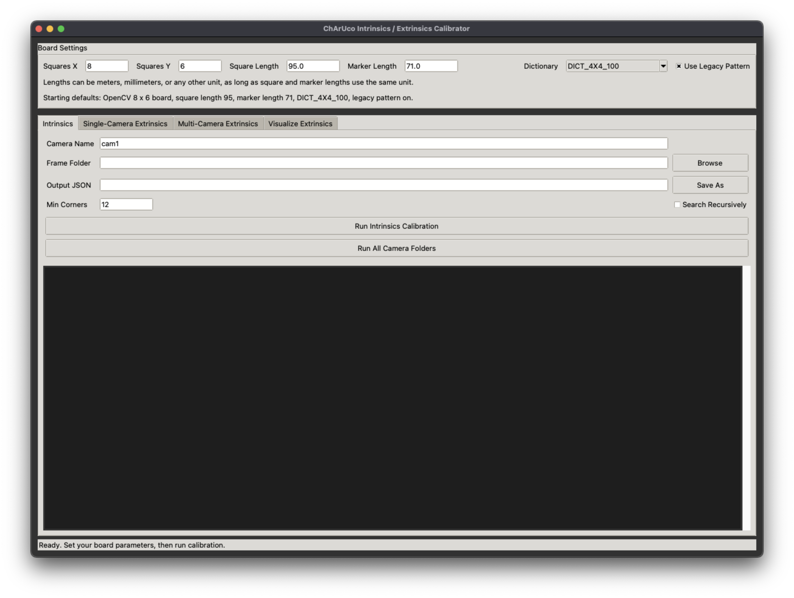
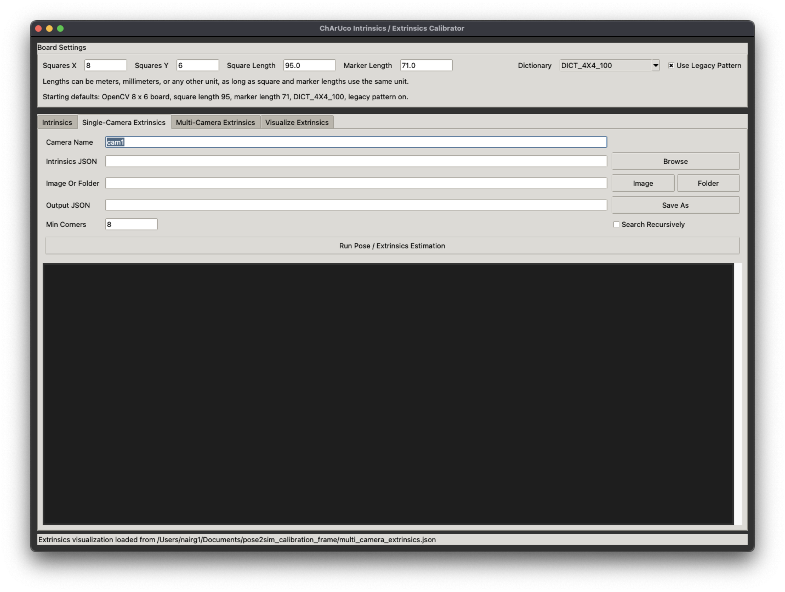
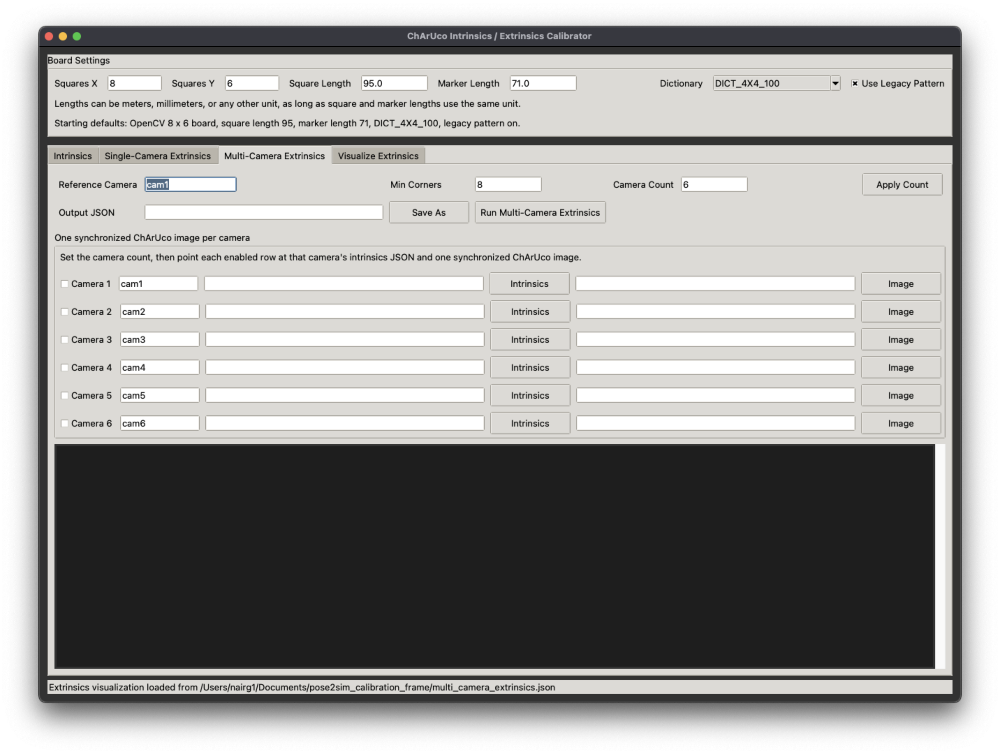
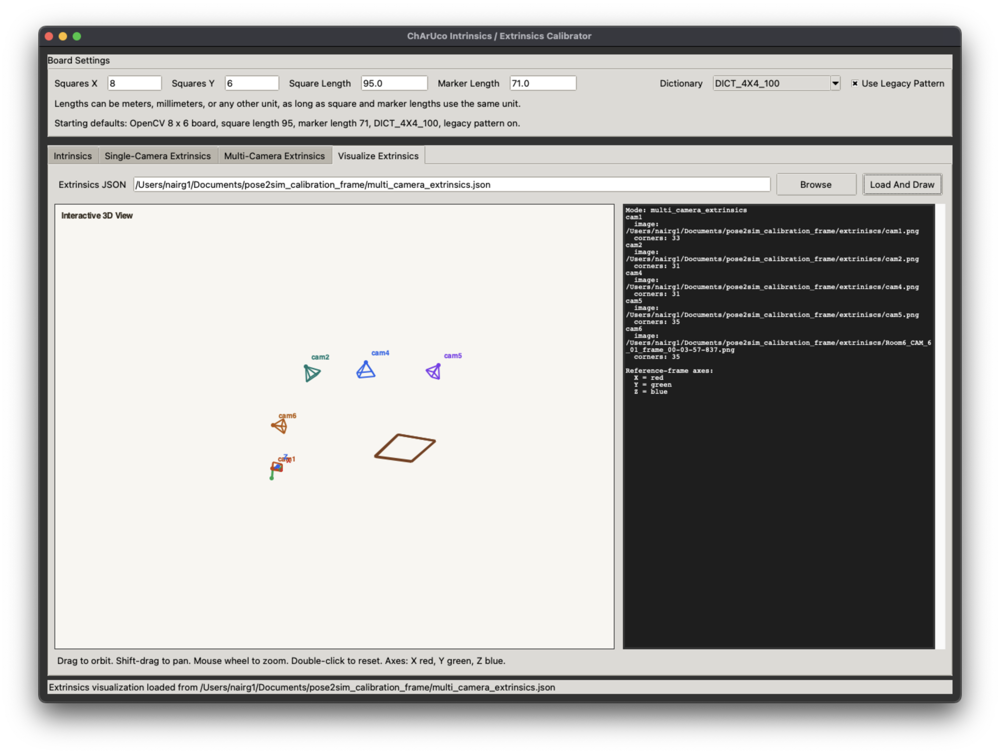

# ChArUco Calibrator GUI

Desktop GUI for ChArUco-based camera calibration with support for:

- camera intrinsics calibration from image folders
- single-camera extrinsics from one image or a batch of images
- multi-camera relative extrinsics from synchronized frames
- 3D transform visualization from saved calibration JSON files

## Overview

This repository packages a Tkinter desktop app for ChArUco calibration workflows in a GitHub-friendly layout.

The GUI includes dedicated tabs for:

- `Intrinsics`
- `Single-Camera Extrinsics`
- `Multi-Camera Extrinsics`
- `Visualizer`

Default board settings match the app's built-in startup values:

- OpenCV-style `8 x 6` ChArUco board
- square length `95`
- marker length `71`
- dictionary `DICT_4X4_100`
- legacy pattern enabled

## Features

- Runs as a simple desktop app with no web stack required
- Uses `opencv-contrib-python` so ArUco and ChArUco features are available
- Supports recursive image search for folder-based calibration
- Saves portable JSON outputs instead of relying on machine-specific paths
- Generates single-image, batch extrinsics, and multi-camera transform outputs

## Project Layout

```text
charuco_calibrator_public/
├── charuco_calibrator_gui.py
├── requirements.txt
├── README.md
├── docs/
│   └── images/
└── src/
    └── charuco_calibrator/
        ├── __init__.py
        ├── __main__.py
        └── gui.py
```

## Install

```bash
python3 -m pip install -r requirements.txt
```

Required dependencies:

- `numpy>=1.26`
- `opencv-contrib-python>=4.10`

Important:

- You need `opencv-contrib-python`, not plain `opencv-python`
- `square_length` and `marker_length` must use the same real-world unit
- Intrinsics calibration needs at least 3 accepted ChArUco frames
- Multi-camera calibration expects one synchronized image per camera showing the same board pose

## Run

Use the thin launcher:

```bash
python3 charuco_calibrator_gui.py
```

Or run the package entrypoint:

```bash
PYTHONPATH=src python3 -m charuco_calibrator
```

Optional lightweight self-check:

```bash
PYTHONPATH=src python3 -m charuco_calibrator --self-check
```

## Output Behavior

The app is set up with portable defaults:

- output files are written under `charuco_calibration_output/`
- input paths start blank so each user can choose local data
- multi-camera rows start with generic names like `cam1`, `cam2`, and can be resized to match the rig

## Typical Workflow

### 1. Intrinsics

1. Open the `Intrinsics` tab.
2. Set the board geometry and dictionary.
3. Choose a folder of ChArUco images for one camera.
4. Run calibration and save `<camera_name>_intrinsics.json`.

### 2. Single-Camera Extrinsics

1. Open the `Single-Camera Extrinsics` tab.
2. Load that camera's intrinsics JSON.
3. Choose one image or a folder of ChArUco frames.
4. Run the solve and save the output JSON.

### 3. Multi-Camera Extrinsics

1. Open the `Multi-Camera Extrinsics` tab.
2. Set `Camera Count`, then click `Apply Count`.
3. Enable each camera row you want to solve.
4. For each enabled row, select an intrinsics JSON and one synchronized image.
5. Choose a reference camera and run the solve.
6. Save the resulting multi-camera JSON.

### 4. Visualizer

1. Open the `Visualizer` tab.
2. Load a saved extrinsics or multi-camera JSON file.
3. Inspect the transforms in the built-in 3D view.

## Screenshots

### Intrinsics



### Single-Camera Extrinsics



### Multi-Camera Extrinsics



### Visualizer



## Notes

- Supported image types include `.bmp`, `.jpeg`, `.jpg`, `.png`, `.tif`, and `.tiff`
- Camera and output names are sanitized before writing files
- Batch extrinsics mode records successful poses and failed images separately

## License

Add your project license here if you plan to publish the repository broadly.
