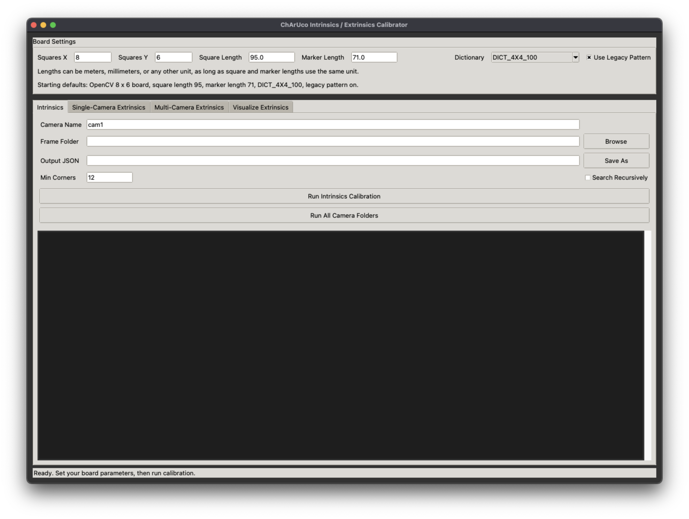
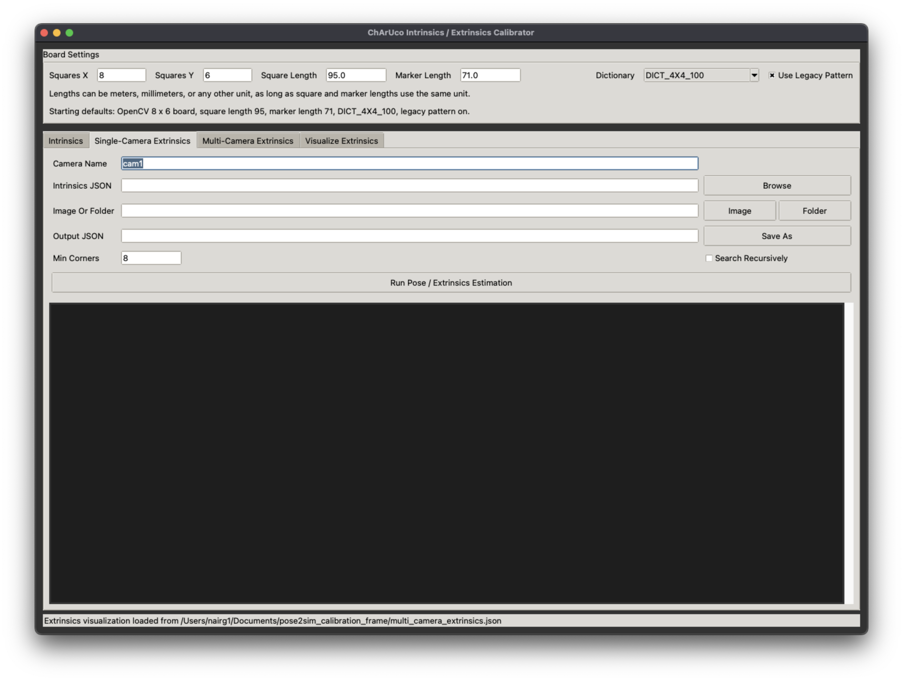
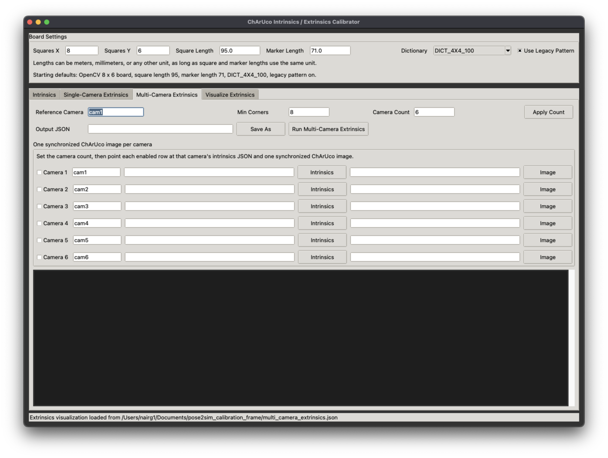
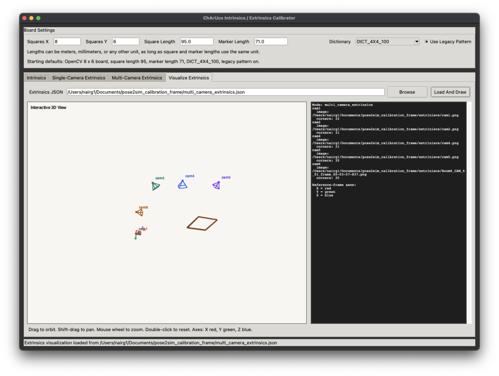

# ChArUco Calibrator GUI

Desktop GUI and headless CLI for ChArUco-based camera calibration with support for:

- camera intrinsics calibration from image folders or videos
- single-camera extrinsics from one image, a batch of images or a video
- multi-camera relative extrinsics from one or many synchronized frame sets
- 3D transform visualization from saved calibration JSON files

## Overview

This repository packages a Tkinter desktop app for ChArUco calibration workflows in a GitHub-friendly layout.

The GUI includes dedicated tabs for:

- `Intrinsics`
- `Single-Camera Extrinsics`
- `Multi-Camera Extrinsics`
- `Visualizer`

Default board settings match the app's built-in startup values:

- OpenCV-style `8 x 6` ChArUco board
- square length `95`
- marker length `71`
- dictionary `DICT_4X4_100`
- legacy pattern enabled

## Features

- Runs as a simple desktop app with no web stack required
- Uses `opencv-contrib-python` so ArUco and ChArUco features are available
- Supports recursive image search for folder-based calibration
- Saves portable JSON outputs instead of relying on machine-specific paths
- Generates single-image, batch extrinsics, and multi-camera transform outputs
- Flags implausible intrinsics instead of silently saving them (see [Intrinsics Safeguards](#intrinsics-safeguards))
- Headless command line for scripted runs (see [Command Line](#command-line))

## Project Layout

```text
charuco_calibrator_public/
├── charuco_calibrator_gui.py
├── requirements.txt
├── README.md
├── docs/
│   └── images/
└── src/
    └── charuco_calibrator/
        ├── __init__.py
        ├── __main__.py
        ├── cli.py      # argument parsing and headless commands
        ├── core.py     # detection, calibration and JSON logic (no tkinter)
        └── gui.py
tests/                  # pytest suite on synthetic boards
```

## Install

```bash
python3 -m pip install -r requirements.txt
```

Required dependencies:

- `numpy>=1.26`
- `opencv-contrib-python>=4.10`
- optional: `scipy` for least-squares refinement of multi-camera extrinsics

OpenCV compatibility: the code uses the object API (`cv2.aruco.CharucoDetector`, `cv2.aruco.ArucoDetector`,
`CharucoBoard.matchImagePoints`, `cv2.calibrateCamera`, `cv2.solvePnP`). The old function API
(`detectMarkers`, `interpolateCornersCharuco`, `calibrateCameraCharuco`, `estimatePoseCharucoBoard`) was removed
from OpenCV 4.8+ and is not used. Tested with OpenCV 4.10 and 5.0.

Important:

- You need `opencv-contrib-python`, not plain `opencv-python`
- `square_length` and `marker_length` must use the same real-world unit
- Intrinsics calibration needs at least 3 accepted ChArUco frames
- Multi-camera calibration accepts one synchronized image per camera, or folders / videos holding many synchronized frame sets

## Run

Use the thin launcher:

```bash
python3 charuco_calibrator_gui.py
```

Or run the package entrypoint:

```bash
PYTHONPATH=src python3 -m charuco_calibrator
```

Self-check (renders a synthetic board, detects it and recovers its pose):

```bash
PYTHONPATH=src python3 -m charuco_calibrator --self-check
```

## Command Line

Any subcommand runs headless; tkinter is imported only when the GUI starts.

```bash
export PYTHONPATH=src
BOARD="--squares-x 8 --squares-y 6 --square-length 0.0948 --marker-length 0.0711 --dictionary DICT_4X4_50 --legacy-pattern"

# intrinsics from an image folder or a video (every 30th frame)
python3 -m charuco_calibrator intrinsics --images frames/cam1 --camera-name cam1 --output cam1.json $BOARD
python3 -m charuco_calibrator intrinsics --video cam1.mp4 --every 30 --output cam1.json $BOARD

# board pose for one camera
python3 -m charuco_calibrator extrinsics --intrinsics cam1.json --image frame.png --output cam1_pose.json $BOARD

# relative extrinsics; repeat --camera/--intrinsics/--source per camera
python3 -m charuco_calibrator multi \
  --camera cam1 --intrinsics cam1.json --source sync/cam1 \
  --camera cam2 --intrinsics cam2.json --source sync/cam2 \
  --reference cam1 --output rig.json $BOARD
```

Intrinsics options: `--fix-aspect-ratio`, `--fix-k3/--no-fix-k3` (default on), `--zero-tangential`,
`--fix-principal-point`, `--max-frames N` (pose-diverse selection, 0 = all), `--no-auto-constrain`,
`--fail-on-warnings` (exit status 2 when quality warnings exist). Run `python3 -m charuco_calibrator <command> -h`
for the full list.

## Intrinsics Safeguards

- `fix k3` is on by default; fixed aspect ratio, zero tangential distortion and fixed principal point are optional (GUI checkboxes and CLI flags)
- frames are chosen for pose diversity (board orientation and image coverage) up to `Max Frames`
- after calibration the log lists, and the JSON stores as `quality_warnings`: fx/fy outside 0.9-1.1, principal point far from the image centre, implausible focal length, too few distinct board orientations, poor corner coverage
- when fewer than 3 distinct board orientations are seen (for example a static board), the solve is repeated with fixed aspect ratio, centred principal point and zero tangential distortion; the unconstrained matrix is kept as `unconstrained_camera_matrix`
- per-frame reprojection errors are saved for every used frame

## Multi-Camera Extrinsics From Several Frame Sets

Each camera source can be one image, a folder of images or a video. Folder frames are matched across cameras by
file name (or sorted order when no names match), video frames by frame index. A frame set is used when at least
two cameras see the board, so cameras that never see the board at the same time as the reference are chained
through the others. Relative poses are combined with a robust average (outlier frames rejected) and, when scipy is
installed, refined by least squares over all frame sets. The JSON reports per-camera reprojection error before
and after refinement.

## Output Behavior

The app is set up with portable defaults:

- output files are written under `charuco_calibration_output/`
- input paths start blank so each user can choose local data
- multi-camera rows start with generic names like `cam1`, `cam2`, and can be resized to match the rig

## Typical Workflow

### 1. Intrinsics

1. Open the `Intrinsics` tab.
2. Set the board geometry and dictionary.
3. Choose a folder of ChArUco images for one camera.
4. Run calibration and save `<camera_name>_intrinsics.json`.

### 2. Single-Camera Extrinsics

1. Open the `Single-Camera Extrinsics` tab.
2. Load that camera's intrinsics JSON.
3. Choose one image or a folder of ChArUco frames.
4. Run the solve and save the output JSON.

### 3. Multi-Camera Extrinsics

1. Open the `Multi-Camera Extrinsics` tab.
2. Set `Camera Count`, then click `Apply Count`.
3. Enable each camera row you want to solve.
4. For each enabled row, select an intrinsics JSON and one synchronized image, a folder of synchronized frames or a video.
5. Choose a reference camera and run the solve.
6. Save the resulting multi-camera JSON.

### 4. Visualizer

1. Open the `Visualizer` tab.
2. Load a saved extrinsics or multi-camera JSON file.
3. Inspect the transforms in the built-in 3D view.

## Screenshots

### Intrinsics



### Single-Camera Extrinsics



### Multi-Camera Extrinsics



### Visualizer



## Notes

- Supported image types include `.bmp`, `.jpeg`, `.jpg`, `.png`, `.tif`, and `.tiff`
- Camera and output names are sanitized before writing files
- Batch extrinsics mode records successful poses and failed images separately
- JSON outputs keep all earlier keys; new fields are only added, so older files still load in the visualizer and extrinsics tabs

## License

This repository is licensed under the PolyForm Noncommercial License 1.0.0.

- Non-commercial use is allowed
- Commercial use is not allowed without separate permission from the licensor
- See [LICENSE](/Users/nairg1/Documents/charuco_calibrator_public/LICENSE) for the full terms

Note:

- This is source-available for non-commercial use
- It is not an OSI open source license because commercial use is restricted
